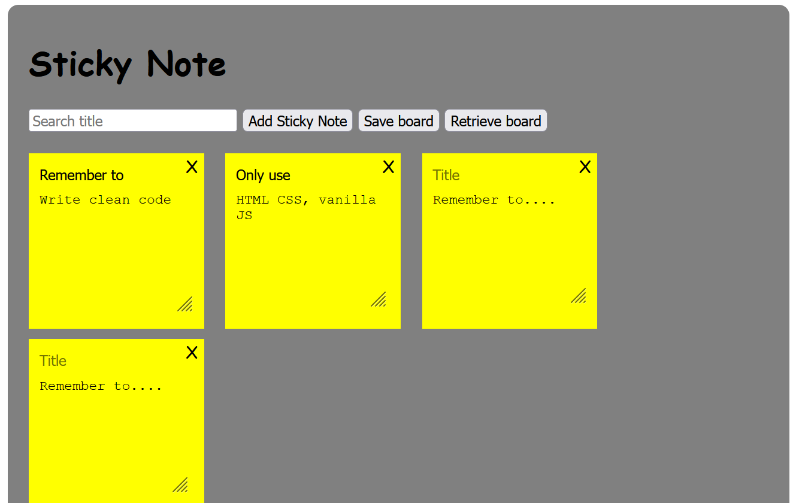

## Lenskart Assignment - Sticky Note

This is a front end assignment and the goal is to check if the candidate is able to build an application from scratch using only vanilla Javascript, HTML and CSS. The candidate should know how to use these technologies without any help from external libraries or external resources.

We will be looking out for clean code and documentation, responsiveness and your use of Git.

#### Requirements:
Create a single page Sticky note app. The user should be able to:
- Edit the title and content of the notes,
- Save all your notes (Persistence in browser),
- Add new notes,
- Delete notes,
- Filter notes using to a search bar

Explain in simple words how to run your project within your README file. Create a public github repository that you will send to us.
For implementation you should and can only use Javascript, HTML5, CSS3. It will be great if you are able to deploy a working version of the page.

Remarks:

Attached image is just an example, Feel free to build the app anyway you see fit, and add anything you find meaningful to your application as long as the above requirements are met.

